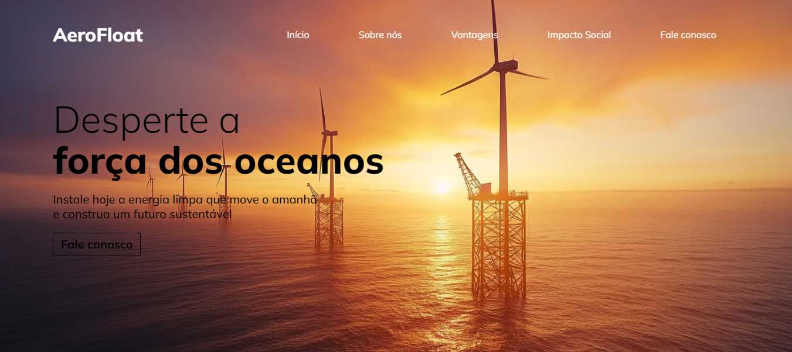

# AeroFloat Energy - CPDI 🚀

 

## 💻 Sobre

Este projeto foi desenvolvido no curso Programando meu Futuro, organizado pelo <a href="https://cpdi.org.br/">CPDI</a>, com base no Objetivo de Desenvolvimento Sustentável da ONU que trata sobre **Energia Limpa e Acessível**, que busca garantir o acesso a fontes de energia confiáveis e sustentáveis. A AeroFloat Energy tem o compromisso de contribuir para esse objetivo, promovendo soluções de energia eólica offshore inovadoras e sustentáveis.
  
***A proposta do curso <a href="https://www.sympla.com.br/evento-online/programando-meu-futuro/2516166?referrer=cpdi.org.br">Programando meu Futuro</a> é ensinar como se programa um site de forma que uma empresa tenha uma presença de sucesso na internet, então utilizamos:***

+ HTML e CSS, com foco em organização e boas práticas;
+ Acessibilidade;
+ Responsividade;
+ Variáveis e condições em JS;
+ Bibliotecas de terceiros.

## 🧠 Tecnologias usadas

    
    
    

## Desenvolvedores e Contribuintes

[ Fillypper](https://github.com/Fillypper) | [ João Airton](https://github.com/joaoairton) | [ João Luis](https://github.com/jbimgomes)
| :---: | :---: | :---:

 
